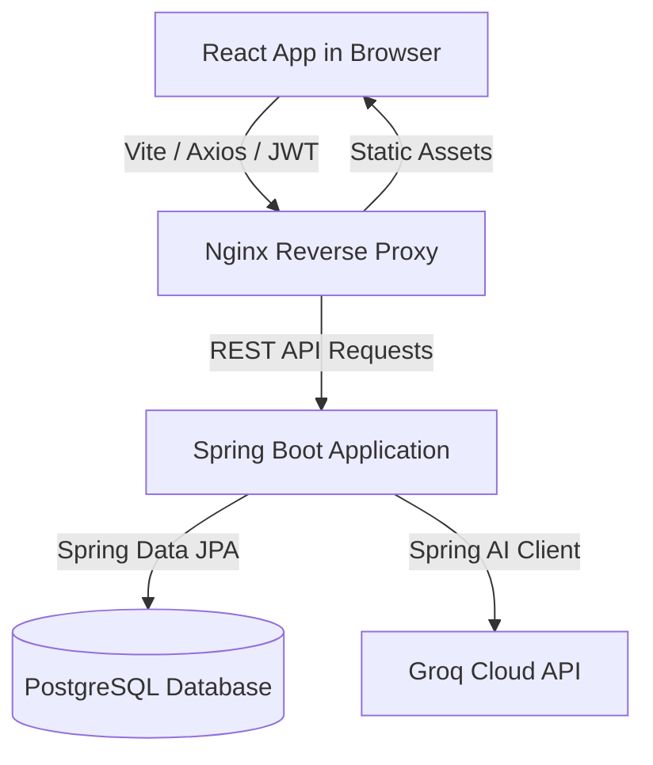

# RiskLens — Asset-Liability Management & Liquidity Risk Platform

RiskLens is a production-grade, containerized Asset-Liability Management (ALM) & Liquidity Risk platform designed for commercial banks, NBFCs, and financial treasuries. 

It calculates structural interest and principal cash flows in real-time, bucketizes them into standard regulatory maturity intervals, calculates mismatch gaps, runs AI-powered balance sheet advisory diagnostics, and provides an interactive chatbot with agentic database modification capabilities.

---

## ⚠️ Problem Statement
Commercial banks and Non-Banking Financial Companies (NBFCs) face significant operational and regulatory hurdles in managing structural liquidity. Key issues include:
* **Asset-Liability Mismatches:** Fluctuations in interest rates and varying maturity profiles of assets (e.g., long-term loans) versus liabilities (e.g., short-term retail deposits) create structural gaps, exposing institutions to funding bottlenecks or liquidity distress.
* **Complex Cash Flow Modeling:** Dynamically projecting cash flows for complex amortization structures (bullet payments, reducing balances, periodic interest accruals) across large portfolios is computationally intensive and prone to legacy system delays.
* **Static Risk Metrics:** Traditional ALM systems rely on rigid monthly reporting cycles, lacking real-time insights or interactive simulation tools to test portfolio adjustment scenarios.

## 🎯 Objectives
The core goals of the RiskLens platform are:
* **Real-time Gap Ladder Visualization:** Aggregates projected cash inflows and outflows into standard regulatory maturity buckets (from `0-7 days` to `5+ years`) to monitor net funding requirements.
* **Automated Cash Flow Projection:** Provides a robust, audited computation engine that calculates exact principal and interest schedules based on contract specifications.
* **Interactive Scenario Advisory:** Integrates AI Copilot capabilities to simulate balance sheet adjustments, perform compliance checks, and execute database operations via natural language commands.
* **Production-Grade Audit & Security:** Establishes an immutable audit trail capturing user authentication, CSV/PDF bulk uploads, and database modifications for regulatory compliance.

---

## 🛠️ Technology Stack & Architecture

RiskLens is split into three decoupled components orchestrating communication via REST APIs:



### 1. Backend (Spring Boot API Server)
* **Framework:** Spring Boot 3.3, Spring Security (JWT authentication + cookie-based token rotation), Spring Data JPA.
* **AI Capabilities:** Spring AI (`spring-ai-openai-spring-boot-starter`) connected to Groq Cloud (`llama-3.3-70b-versatile` endpoint) for balance sheet insights and agentic database modifications.
* **PDF Ingestion:** Apache PDFBox 3.0.2 for robust multi-page table extraction.
* **Database Migration:** Flyway for automated schema versioning.

### 2. Frontend (React Single Page App)
* **Build Engine:** Vite, React 19.
* **Motion & Charts:** Framer Motion 12, Chart.js 4, React-ChartJS-2.
* **Data Layer:** Axios with a global interceptor managing automatic multipart form boundaries and token headers.

### 3. Database (PostgreSQL)
* PostgreSQL 16 storing core entity relationships (instruments, cash flows, audit logs, and counterparties).

---

## 🔐 Default Seeded Demo Accounts

The database is pre-seeded with three demo accounts covering key organizational roles:

| Role | Username (Email) | Password | Access Level |
|:---|:---|:---|:---|
| **ADMIN** | `admin@risklens.com` | `Admin@123` | Full dashboard access, audit logs view, user configuration |
| **RISK_MANAGER** | `risk@risklens.com` | `Risk@123` | Instrument CRUD, CSV/PDF upload, gap computation |
| **VIEWER** | `viewer@risklens.com` | `View@123` | Read-only access to gap report, chart dashboards |

---

## 🚀 How to Run the Platform (Docker Compose)

Execute the standard docker-compose command from the root of the project to build and start the entire stack:

```bash
# 1. Copy the environment variables file
cp .env.example .env

# 2. Add your Groq API Key to .env (Default fallbacks exist to prevent crash if empty)
# OPENAI_API_KEY=gsk_your_key_here

# 3. Build and launch the container stack
docker compose up --build
```

### Port Mappings
* **Frontend Web Application:** Access at [http://localhost](http://localhost) (Port `80`).
* **API Swagger Documentation:** Access at [http://localhost:8080/swagger-ui.html](http://localhost:8080/swagger-ui.html).

---

## 💻 Manual Start (Local Development)

### 1. Start the PostgreSQL Database
```bash
docker run --name risklens-postgres \
  -e POSTGRES_DB=risklens \
  -e POSTGRES_USER=risklens \
  -e POSTGRES_PASSWORD=risklens123 \
  -p 5432:5432 -d postgres:16-alpine
```

### 2. Launch the Spring Boot Server
```bash
cd backend
mvn spring-boot:run
```

### 3. Launch the React Development Server
```bash
cd frontend
npm install
npm run dev
```
Open [http://localhost:5173](http://localhost:5173) in your browser.

---

## 📈 Functional Flow & Calculations

### 1. Instrument Registry
Instruments are classified into:
* **Assets:** Generate cash inflows (e.g. Corporate Loans, Treasury Bonds, Reverse Repos).
* **Liabilities:** Generate cash outflows (e.g. Retail Deposits, Commercial Papers, Borrowings).

### 2. Cash Flow Projection Engine
Upon instrument creation (manual, CSV upload, PDF parse, or AI generated), the engine projects principal and interest payment schedules:
* **Bullet Repayments:** Full principal returned at maturity, interest paid periodically (monthly, quarterly, annually).
* **Amortizing Repayments:** Principal split evenly across payment intervals along with interest due on outstanding balances.

### 3. Regulatory Gap Ladder
For a given as-of date, the cash flow amounts are aggregated into standard time buckets based on remaining days to maturity:
1. `0-7 days`
2. `8-14 days`
3. `15-30 days`
4. `1-3 months`
5. `3-6 months`
6. `6-12 months`
7. `1-3 years`
8. `3-5 years`
9. `5+ years`

### 4. Risk KPI Computation
* **Cash & Liquid Assets:** Cumulative asset inflows.
* **Liability Drawdowns:** Cumulative liability outflows.
* **Net Buffer Gap:** Total Inflows - Total Outflows.
* **Max Maturity Gap:** The largest mismatch where outflows exceed inflows in any single bucket.

---

## 🤖 AI Copilot & Agentic Actions
The dashboard is equipped with an interactive AI Copilot drawer that communicates with a LLM model. It processes strategy queries and executes agentic commands:
* **`CREATE_INSTRUMENT`**: "Add a loan of 50 lakhs for client X at 12% interest for 3 years."
* **`DELETE_INSTRUMENT`**: "Remove the deposit with ID 24."
* **`GENERATE_PORTFOLIO`**: "Generate an asset-heavy portfolio of 15 instruments."
* *When the AI finishes executing a command, the dashboard automatically recasts calculations and refreshes all charts in real-time.*

---

## ⚖️ License

Distributed under the MIT License. See `LICENSE` for more information.
